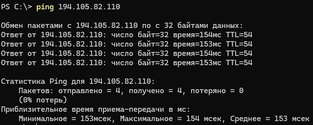
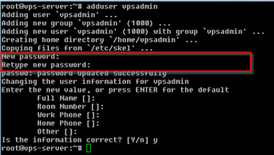

### Первоначальная настройка сервера

Кто уже аредновал сервер переходите [к шагу 2](#шаг-2-проверка-ip-адреса-и-подключение-к-серверу)

# Шаг 1. Выбор и покупка VPS/VDS сервера
---
Тут я подсказывать не буду хостеры постояно меняются, где-то становится дорого, где-то запрашивают личные данные, паспорта и так далее, по этому просто расскажу про китерии выбора сервера.

Критерии:

- &ensp; Способ оплаты: поддерживается оплата российскими картами МИР (если у вас есть карты Visa/Mastercard или другие способы оплаты, например, криптовалютой, то этот пункт вам не важен).
- &ensp; Идеальным способом оплаты будет оплата анонимной криптовалютой (Altcoin) Monero/Dash/Zcash (но далеко не все провайдеры имеют такой способ оплаты, вот список тех, кто поддерживает).
- &ensp; Страна хостера и его офисов (не путать с физическим расположением VPS-сервера): недавно в РФ приняли закон о том, что хостеры должны вноситься в определённый реестр, что влечёт обязательства слива ваших данных властям, поэтому многие хостеры разграничили свою деятельность в РФ со счётом в рублях (.ru сайт) и за рубежом за счётом в долларах/евро (.net или .com сайт), хотя продолжают принимать российские карты. Рекомендуется выбирать хостинг, который располагается не в РФ.
- &ensp; Географическое расположение сервера: один из самых важных пунктов. При аренде сервера можно выбрать страну, в которой он будет располагаться. Очевидно, что сервер не должен располагаться в России, ведь тогда ни к каким заблокированным сайтам/сервисам мы доступ не получим. Какую страну выбрать? Зависит от ваших потребностей, но я рекомендую страны, удовлетворяющие всем или большинству условий ниже:
    - &emsp; Чем ближе к РФ, тем лучше.
    - &emsp; Страна имеет связи с другими странами, в том числе с РФ по глобальным волоконно-оптическим кабелям Интернета.
    - &emsp; В этой стране доступны все заблокированные в РФ ресурсы (Discord, YouTube, ChatGPT, Instagram, Twitter (X) и т.д.), а также страна сама ничего важного для вас не блокирует. Узнать это легко можно в google.
    - &emsp; Правительство страны стабильно и в стране строго относятся к защите личной информации (Иран или страны Африки, скорее всего вам не подойдут).
    - &emsp; Желательно, чтобы страна не входила в "Альянс пяти глаз" по сбору информации (США, Великобритания, Канада, Новая Зеландия, Австралия), а ещё лучше, чтобы не входила в "Альянс 14 глаз" (Альянс 5 глаз + Дания, Франция, Норвегия, Нидерланды, Германия, Бельгия, Швеция, Испания, Италия).
    - &emsp; Желательно, в выбранной стране не должно быть наказания за цифровое пиратство и она лояльна к анонимным сетям (если это важно для вас).
    - &emsp; Из всего сказанного выше могу порекомендовать следующие страны: Ирландия, Румыния, Исландия, Швейцария, страны Индии.
    - &emsp; На крайний случай: Нидерланды, Швеция, Германия, Сингапур, Тайвань, Япония.
- &ensp; Конфиденциальность: при регистрации и заказе сервера, провайдер не должен требовать с вас номер телефона или паспортные данные (часть серверов требуют их, но никак не проверяют, так что такие тоже подойдут).
- &ensp; Безопасность: провайдер предоставляет базовую или платную защиту от DDOS-атак и резервное копирование данных.
- &ensp; Время непрерывной работы (Аптайм, Uptime): указывает на процент времени, в течение которого сервер доступен. Хороший провайдер VPS должен гарантировать минимум 99.9% аптайма, чтобы минимизировать возможные простои. Также стоит смотреть отзывы и гуглить случаи долгих сбоев у потенциального хостера.
- &ensp; Технические характеристики (железо): будут зависеть от кол-ва пользователей, которое будет обслуживать ваш VPS, если это только для вас и вашей семьи (до 10-15 устройств), то вам подойдёт железо со следующими характеристиками:
    - &emsp; Не берите дешёвые сервера, с ОС на HDD дисках, они медленные. Выбирайте сервера на SSD NVME накопителях с размером от 10 Гб (для своего прокси большие объёмы вам ни к чему).
    - &emsp; ОЗУ минимум 1 ГБ, лучше от 2Гб ОЗУ.
    - &emsp; Кол-во ядер ЦП 1 или 2 (от 3 ГГЦ), не берите сервера на старых и медленных процессорах.
    - &emsp; Трафик (объём передаваемой информации): безлимитный или очень большой (например 32 Терабайта в месяц). Многим хватает 3 ТБ в месяц, но не всем. Безлимитных вариантов на рынке много.
    - &emsp; Ширина канала: 100 Мбит. Если у вас быстрый домашний/рабочий интернет, то можно смотреть в сторону 1 Гбит, такие предложения на рынке есть.
- &ensp; Операционная система (ОС): это в любом случае будет дистрибутив Linux (с этим вам придётся смириться). Я рекомендую Debian 12 64-bit (в крайнем случае используйте Debian 11 или Ubuntu 22.04 LTS). При использовании других дистрибутивов некоторые команды для вас могут отличаться!
- &ensp; IP-адреса: хостер должен предоставлять нормальный белый IP-адрес в той стране, где заявлено. Иногда может предоставляться IP-адрес в России, но тогда через техподдержку его можно попросить заменить. Как точно проверить местоположение IP-адреса расскажу позже.

С самой арендой и оплатой сервера я думаю вы уже разберётесь так что переходим к следующему шагу.

# Шаг 2. Проверка IP-адреса и подключение к серверу
---
Теперь, когда у нас есть сервер, надо проверить нашего VPS-провайдера на честность. Проверим полученный IP-адрес сервера (в каждом из случаев, если IP-адрес не проходит проверку, попросите у техподдержки его поменять с объяснением причин).
1. &ensp; Для начала проверим, доступен ли ваш сервер вообще. Откройте консоль (нажмите Win + R и впишите cmd ) и пропишите команду ping server_ip . Если вам приходит ответ, значит всё в порядке и сервер доступен (к слову, по величине задержки можно судить о том, как далеко от вас находится сервер). Если ответа нет, убедитесь, что в личном кабинете статус сервера "запущен"/"работает" и тогда уже пишите в техподдержку.



2. &ensp; Проверим наличие IP-адреса в чёрных списках Роскомнадзора (тут или тут).
3. &ensp; Теперь проверим наличие IP-адреса в спам-базах (тут). Одна-две записи - это относительно нормально, а вот большее кол-во вызывает вопросы.

Теперь можно подключаться. Открываем консоль (например, сочетанием клавиш Win + R и вбить "cmd" или "powershell". К слову, у Microsoft есть очень удобное приложение для работы с разными терминалами, называется Windows Terminal) и вводим команду подключения к серверу по SSH, нажимаем Enter. При первом подключении вас спросят, доверяете ли вы серверу. Говорим да и вводим пароль от root, который вы сохраняли ранее (не пугаемся, для безопасности отображаться он не будет).
```
# Где root - имя суперпользователя, xxx.xxx.xxx.xxx - ip-адрес вашего VPS-сервера
ssh root@xxx.xxx.xxx.xxx
# Например:
ssh root@194.105.82.110
```

# Шаг 3. Базовая настройка и обеспечение безопасности сервера
Ваш сервер вряд ли представляет "лакомый кусочек" для
злоумышленников, однако необходимо закрыть самые базовые
уязвимости, чтобы "залётный" хакер не смог вам навредить.
- &ensp; Смена пароля суперпользователя (пользователя root):
Вводим в консоль команду (подразумевается, что вы уже root):
```
passwd
```
Введите новый пароль для root-пользователя (для безопасности, при вводе он не отображается). Затем введите его повторно.
    Вводите сложный пароль длинной 15-20 символов. Он должен состоять из заглавных и строчных букв, цифр и спец символов. А чтобы его легко было запомнить составляйте его из парольных фраз не относящихся к вашей жизни.
    Например, если вы никогда не играли в Minecraft, то подойдёт пароль: Minecraft_eto_moja_jizn’2024!!!2402. Такое легко запомнить и сложно подобрать.
- &ensp; Обновление пакетов.

Наличие последней версии системы по умолчанию увеличивает её безопасность (в новых версиях частенько устраняют известные уязвимости). Следующие три команды обновят информацию об актуальных версиях пакетов, обновят их (это займёт некоторое время), а затем перезагрузят сервер (придётся подключиться повторно):
```
apt update && apt upgrade -y && reboot
```
- &ensp; Защищаем SSH соединение. Залётные хакеры первым делом пытаются подключаться к ssh (по стандартному порту 22, от имени root). Также Роскомнадзор может догадаться смотреть наличие открытого стандартного 22-го ssh порта у вашего сервера. Поэтому сделаем следующее:
    - &emsp; Запретим подключение по ssh пользователю root (подключаться будем через вновь созданного пользователя);
    - &emsp; Изменим стандартный порт подключения ssh (с 22-го на какой-нибудь другой);
    - &emsp; Добавим подключение к ssh по ключам и запретим подключение по паролю.
1. &emsp; Т.к. доступ у root по ssh к серверу мы закроем, то надо создать нового пользователя, через которого и будем дальше подключаться. Создаём пользователя следующей командой (вместо "user_name" впишите любое имя пользователя, которое хотите и не забудете):
```
adduser user_name
```
Далее следуем инструкциям на экране, обязательно указывая пароль пользователя (как обычно, при вводе он не отображается). Прочие поля можно оставлять пустыми.



Перейти от обычного пользователя к root можно командой:
```
su -
```
От суперпользователя к обычному:
```
su user_name
```

